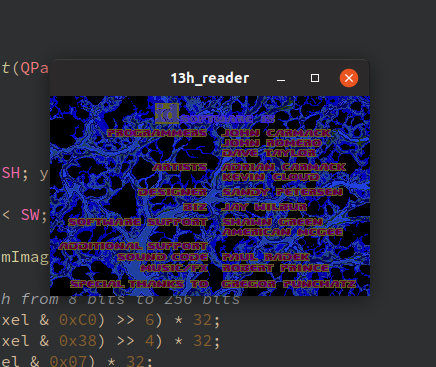

# 13h
Quick and dirty Mode 13h playback application written in Qt. Useful for running Doom without any syscalls but writing every frame into separate files. Not even mapped to the 256 color palette.
